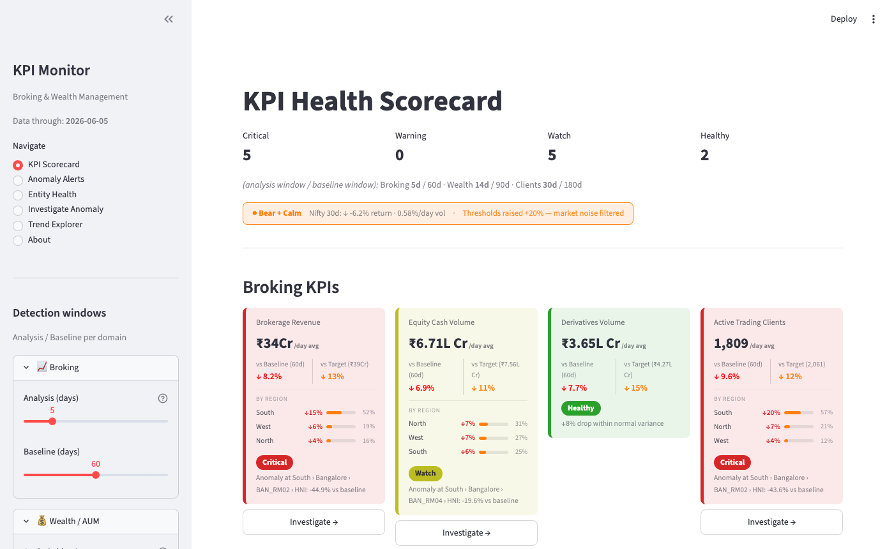
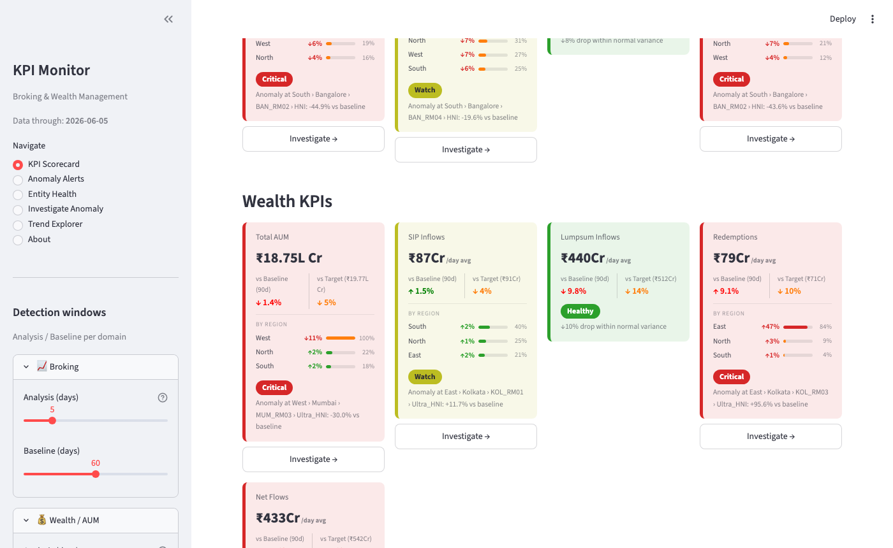
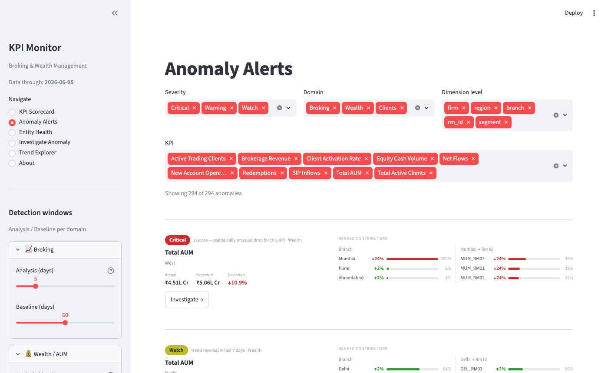
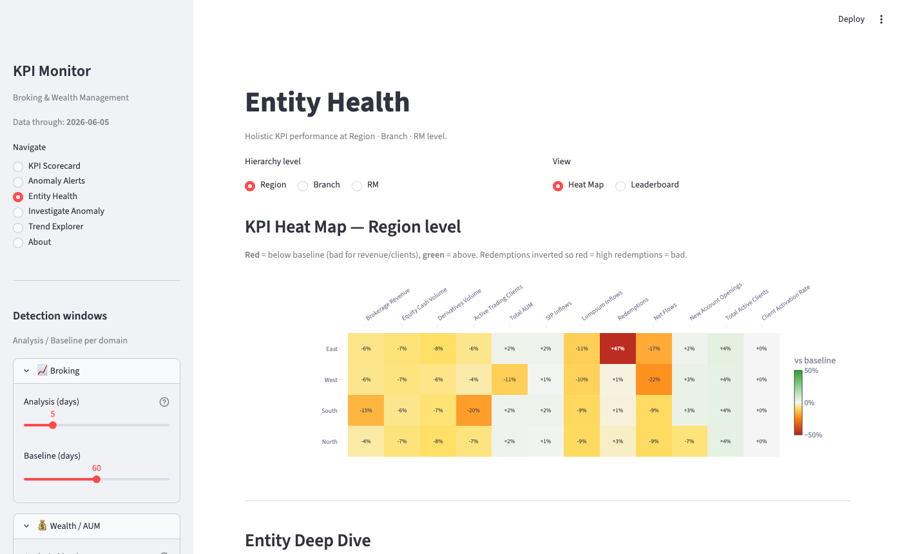
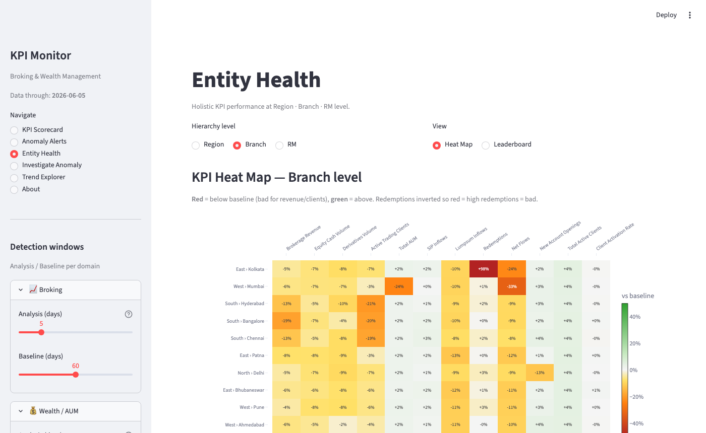
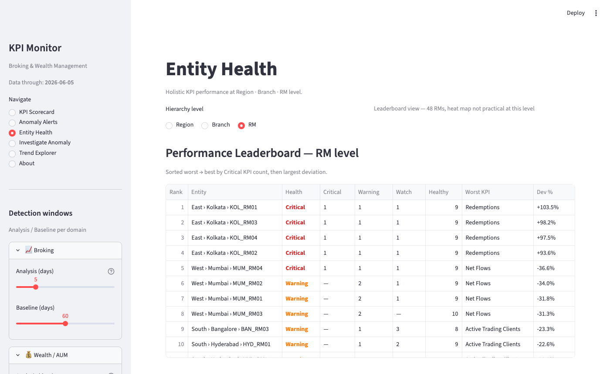
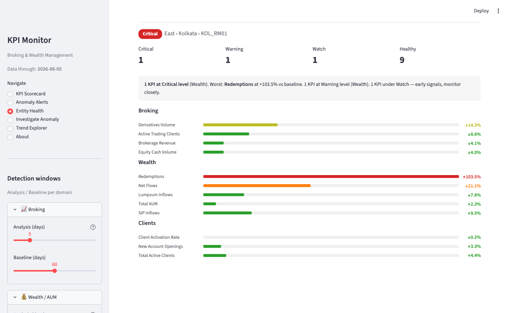
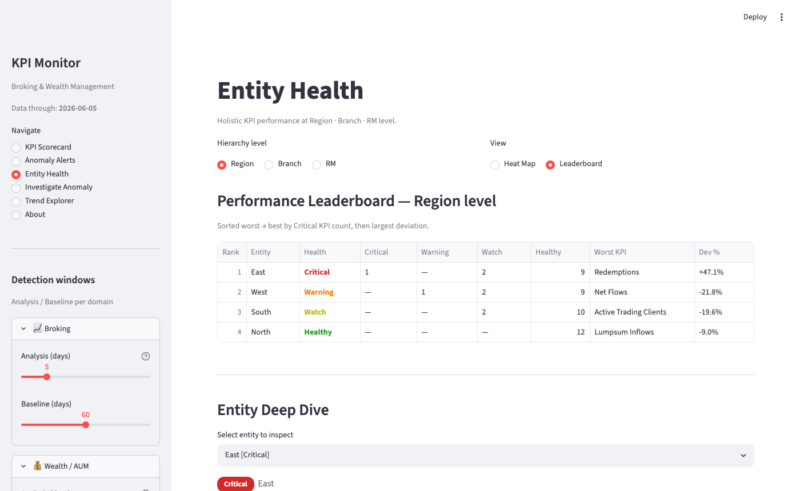
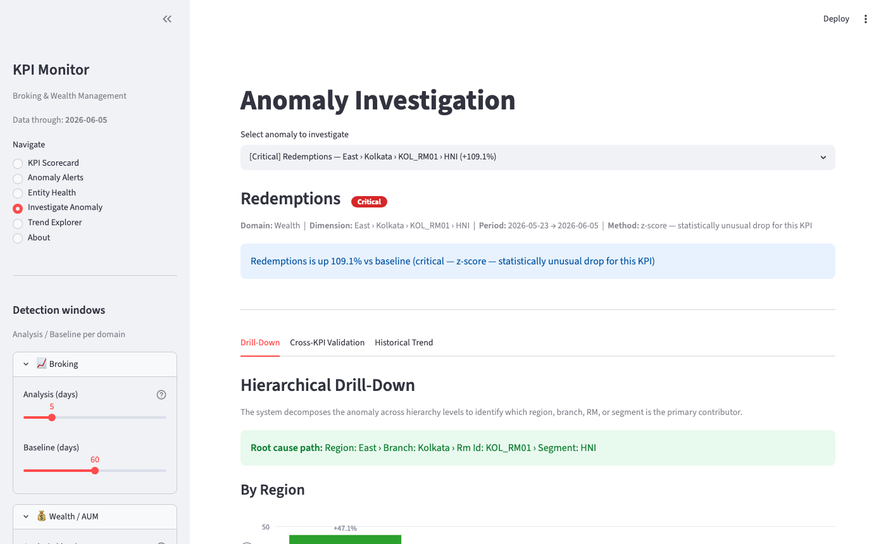
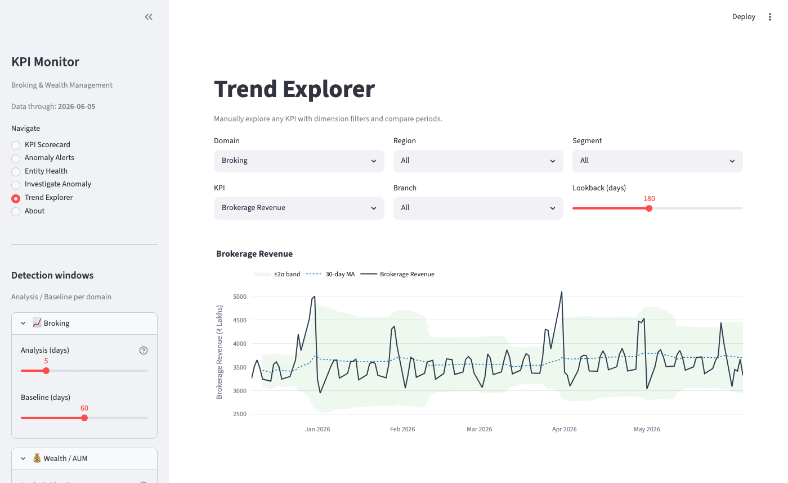

# KPI Monitor — Broking & Wealth Management

A Streamlit dashboard for daily KPI monitoring, anomaly detection, and hierarchical root-cause analysis across Broking, Wealth, and Client domains.

---

## Quick Start

```bash
# 1. Install dependencies
pip install -r requirements.txt

# 2. Generate synthetic data (once)
python3 generate_data.py

# 3. Launch dashboard
streamlit run app.py
# → http://localhost:8501
```

---

## Project Structure

```
KPI monitoring/
├── app.py                       # Streamlit dashboard (6 pages)
├── generate_data.py             # Synthetic data generator (replace with real pipeline)
├── kpi_config.yaml              # KPI registry: thresholds, targets, correlates
├── requirements.txt
├── kpi_monitor/
│   ├── data_loader.py           # DataLoader class — aggregation & helpers
│   ├── anomaly_detector.py      # Z-score + target breach + trend reversal detection
│   ├── drill_down.py            # Hierarchical decomposition Firm→Region→Branch→RM
│   └── correlation.py           # Cross-KPI validation & hypothesis ranking
└── docs/
    ├── screenshots/             # Page screenshots (auto-generated)
    └── take_screenshots.py      # Playwright screenshot script
```

---

## KPIs Monitored

12 KPIs across 3 domains, all configurable in `kpi_config.yaml`:

| Domain | KPI | Unit | Direction |
|--------|-----|------|-----------|
| Broking | Brokerage Revenue | ₹ Lakhs | higher↑ |
| Broking | Equity Cash Volume | ₹ Lakhs | higher↑ |
| Broking | Derivatives Volume | ₹ Lakhs | higher↑ |
| Broking | Active Trading Clients | Count | higher↑ |
| Wealth | Total AUM | ₹ Lakhs | higher↑ |
| Wealth | SIP Inflows | ₹ Lakhs | higher↑ |
| Wealth | Lumpsum Inflows | ₹ Lakhs | higher↑ |
| Wealth | Redemptions | ₹ Lakhs | lower↓ |
| Wealth | Net Flows | ₹ Lakhs | higher↑ |
| Clients | Total Active Clients | Count | higher↑ |
| Clients | New Account Openings | Count | higher↑ |
| Clients | Client Activation Rate | % | higher↑ |

`Total AUM`, `Total Active Clients`, and `Client Activation Rate` are **stock/rate metrics** (`stock_metric: true` in config) — they display without a `/day avg` label on cards.

---

## Organisation Hierarchy

```
Firm
└── Region (4: North / South / East / West)
    └── Branch (12: 3 per region)
        └── RM (48: 4 per branch)
            └── Segment (3: Retail / HNI / Ultra_HNI)
```

---

## Anomaly Detection

Three complementary methods run for every KPI × dimension combination:

| Method | How it fires | Typical use |
|--------|-------------|-------------|
| **Z-score** | `(actual_mean − baseline_mean) / baseline_std < −threshold` | Statistically unusual drop vs historical baseline |
| **Target breach** | `deviation_pct < −target_breach_pct` | Absolute % fall beyond KPI-specific tolerance |
| **Trend reversal** | 7-day slope flips sign vs 30-day slope | Early warning before z-score fires |

### Severity levels

| Level | Z-score OR deviation % |
|-------|----------------------|
| Critical | `|z| ≥ 3.0` OR `|dev%| ≥ 35%` |
| Warning | `|z| ≥ 2.5` OR `|dev%| ≥ 20%` |
| Watch | triggered but below Warning thresholds |

Only **negative** anomalies are detected (drops for higher-is-better, rises for lower-is-better).

### Volatility-adaptive thresholds

`get_volatility_regime()` compares Nifty 30-day rolling volatility against a 90-day baseline and measures the 30-day cumulative return vs baseline drift. The resulting **market regime badge** (shown on the Scorecard header) scales all detection thresholds:

| Direction | Volatility | Multiplier | Effect |
|-----------|-----------|-----------|--------|
| Bull / Flat | Calm | 1.0× | Standard sensitivity |
| Bull / Flat | Elevated | 1.1–1.2× | Slightly reduced sensitivity |
| Bear | Calm | 1.2× | Raised thresholds (+20%) |
| Bear | Elevated | 1.4× | Raised thresholds (+40%) |
| Bear | High | 1.6× | Raised thresholds (+60%) |

### Domain-specific detection windows

Each domain has independent analysis and baseline windows reflecting how fast that domain's KPIs move:

| Domain | Analysis (default) | Baseline (default) | Rationale |
|--------|-------------------|--------------------|-----------|
| Broking | 5 days | 60 days | Revenue/volumes react daily — short window catches breaks fast |
| Wealth | 14 days | 90 days | AUM & flows change more slowly |
| Clients | 30 days | 180 days | Acquisition & activation are campaign-driven |

All windows are adjustable via the sidebar sliders.

---

## Dashboard Pages

### 1. KPI Health Scorecard





- Summary bar: total Critical / Warning / Watch / Healthy counts
- Market regime badge (Bear+Calm, Bull+Elevated, etc.) with Nifty stats and threshold note
- KPI cards grouped by domain, each showing:
  - Current value (daily avg over analysis window; no `/day avg` for stock metrics)
  - `vs Baseline` delta % with arrow
  - `vs Target` delta % (baseline avg × monthly growth rate)
  - Contribution bar chart by Region (top 3 contributors)
  - Severity badge + root-cause path (deepest anomaly, ranked by severity → hierarchy depth → absolute variance)
  - **Investigate →** button linking directly to that anomaly in the Investigate page
  - For Healthy KPIs with notable negative delta: `↓X% drop within normal variance` note

### 2. Anomaly Alerts



- Filterable list of all detected anomalies
- Filters: **Severity** · **Domain** · **Dimension level** · **KPI** — all persist across page navigation
- Sorted by hierarchy depth (firm → region → branch → rm → segment) then largest contribution
- Each row shows: KPI · dimension path · detection method in plain English · severity badge · deviation %
- **Investigate →** button per row

Detection method labels:
- `z-score — statistically unusual drop for this KPI`
- `target breach`
- `trend reversal in last 7 days`

### 3. Entity Health *(Holistic View)*

**Region Heat Map**


**Branch Heat Map**


**RM Leaderboard**


**Entity Deep Dive**


**Region Leaderboard**


Three views controlled by **Hierarchy level** (Region / Branch / RM) and **View** (Heat Map / Leaderboard):

**Heat Map** (Region and Branch only)
- Rows = entities sorted worst → best
- Columns = all 12 KPIs grouped by domain (Broking | Wealth | Clients)
- Cell colour: red = bad, green = good; `Redemptions` is sign-inverted so red always means a bad outcome
- Values shown as `+X%` / `−X%` vs baseline mean; hover shows actual and baseline values

**Leaderboard** (all levels; forced at RM level — 48 entities)
- Ranked by overall health badge, then largest deviation
- Columns: Rank · Entity · Health · Critical · Warning · Watch · Healthy · Worst KPI · Dev %
- `Health` column colour-coded (Critical=red, Warning=orange, Watch=yellow, Healthy=green)
- Full hierarchy path shown: `East › Kolkata › KOL_RM01`

**Entity Deep Dive** (selectbox, pre-selected to worst entity)
- Health badge + entity path
- Summary metrics (Critical / Warning / Watch / Healthy counts)
- Plain-English assessment: e.g. *"1 KPI at Critical level (Wealth). Worst: Redemptions at +103.5% vs baseline."*
- Horizontal KPI bars grouped by domain, colour-coded by severity, sorted worst first

Severity thresholds for Entity Health (deviation-only, no z-score):
- Critical: `|bad_dev| ≥ 35%`
- Warning: `|bad_dev| ≥ 20%`
- Watch: `|bad_dev| ≥ 10%`
- Healthy: below all thresholds

### 4. Investigate Anomaly



Select any anomaly from the top dropdown (or arrive via Investigate → button). Three tabs:

- **Drill Down** — waterfall / bar chart decomposing contribution at the next hierarchy level; ranks sub-entities by share of the gap
- **Correlations** — validates whether correlated KPIs moved in the same direction; ranks hypotheses (e.g. *"market-driven: Nifty also fell"* vs *"idiosyncratic: only this KPI affected"*)
- **Trend** — historical time-series with 30-day rolling band (mean ± 2σ) to show where the anomaly sits in long-run context

### 5. Trend Explorer



Manual KPI explorer. Filter by Domain → KPI → Region → Branch → Segment with arbitrary lookback window. Overlays rolling mean and ±2σ band. Period comparison tab compares any two custom windows.

### 6. About

System architecture overview, injected demo anomalies, and detection methodology explanation.

---

## Demo Anomalies (in synthetic data)

Four anomalies are injected into the synthetic data to demonstrate the system:

| Anomaly | Location | KPIs affected | Duration | Magnitude |
|---------|----------|---------------|----------|-----------|
| South HNI brokerage collapse | South region, HNI segment | Brokerage Revenue, Active Trading Clients | last 18 days | −48% |
| East Kolkata redemption surge | East → Kolkata branch | Redemptions | last 10 days | +140% |
| North Delhi new account freeze | North → Delhi → Retail | New Account Openings | last 8 days | −96% |
| West Mumbai Ultra-HNI AUM drawdown | West → Mumbai → Ultra_HNI | AUM, Net Flows | last 14 days | −32% |

---

## Configuration Reference

### kpi_config.yaml

Each KPI entry supports:

```yaml
kpi_name:
  display_name: "Human readable name"
  domain: Broking | Wealth | Clients
  unit: "₹ Lakhs" | "Count" | "%"
  direction: higher_is_better | lower_is_better
  stock_metric: true          # optional — suppresses /day avg label on cards
  zscore_threshold: 2.0       # detection fires when |z| > threshold × multiplier
  target_breach_pct: 15       # detection fires when dev% > this × multiplier
  correlates:                 # KPIs to validate against in correlation tab
    - other_kpi
```

### Adding a new KPI

1. Add entry to `kpi_config.yaml`
2. Add to `MONITORABLE_KPIS` list in `kpi_monitor/anomaly_detector.py`
3. Add to `_EH_KPIS` and `_EH_KPI_BY_DOMAIN` in `app.py` if it should appear in Entity Health
4. Re-generate data or wire to real data source

---

## Key Technical Decisions

### Caching strategy
- `@st.cache_resource` — `DataLoader` instance, lives for server lifetime
- `@st.cache_data(ttl=300)` — anomaly results, entity health data, market regime (5-min TTL)
- After adding methods to `DataLoader`, clear `__pycache__` and restart Streamlit to pick up the new instance

### Filter persistence across page navigation
Anomaly Alerts filters use plain session state keys (`_f_sev`, `_f_domain`, `_f_level`, `_f_kpi`) rather than widget `key=` params. Streamlit deletes widget-bound state when the widget isn't rendered; plain keys survive page navigation.

### kpi_worst ranking (scorecard root-cause path)
```python
key = (-severity_score, -hierarchy_depth, -abs(actual - expected))
```
Prefers deepest hierarchy level and largest absolute business impact so the card always shows the most actionable anomaly, not just the highest %-deviation.

### Stock vs flow metrics
`_MEAN_KPIS = {"aum", "client_count", "active_clients", "activation_rate"}` — aggregated with `.mean()` not `.sum()` to avoid window-length inflation. Flagged via `stock_metric: true` in config.

### Market regime formula
- **Volatility**: `recent_30d_std / baseline_90d_std` (relative ratio, not absolute)
- **Direction**: `recent_30d_cumulative_return − baseline_daily_mean × 30`
- Bull if divergence > 3%, Bear if < −3%, Flat otherwise

---

## Reproducing Screenshots

```bash
# Requires: streamlit running on :8501 + playwright installed
pip install playwright && playwright install chromium
python3 docs/take_screenshots.py
```

Screenshots saved to `docs/screenshots/`.
